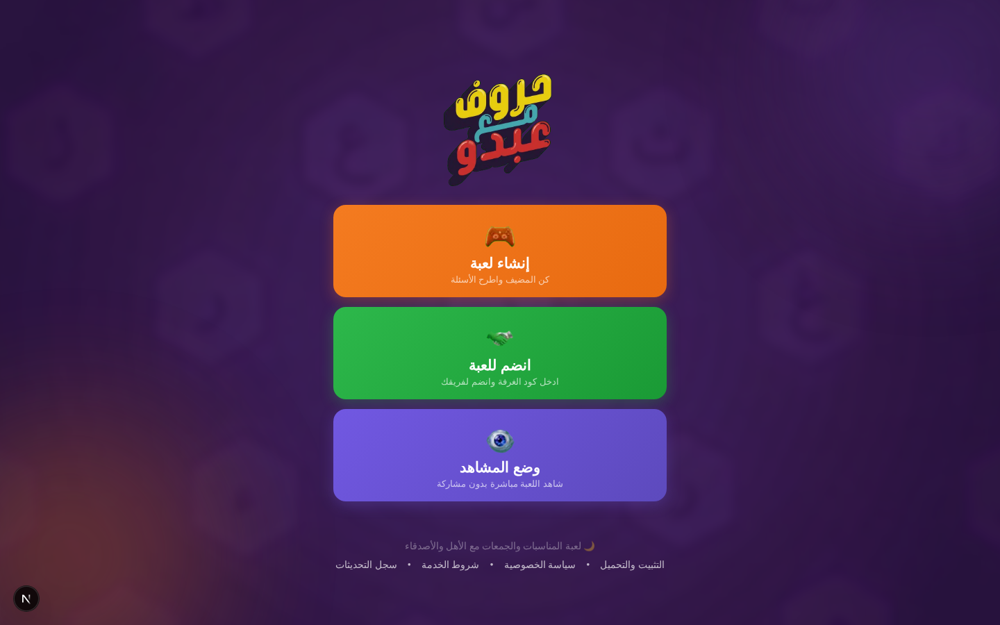
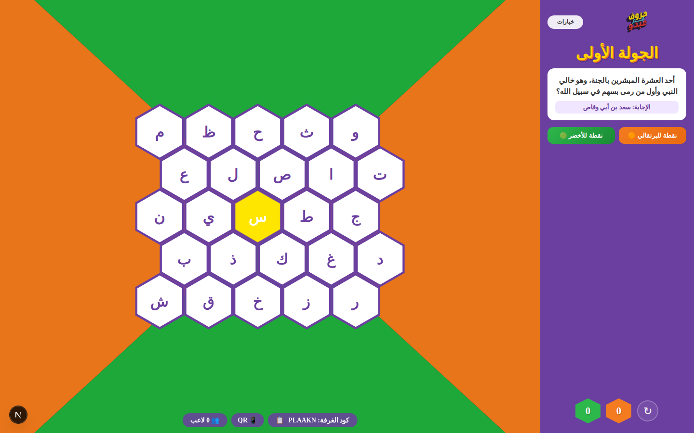
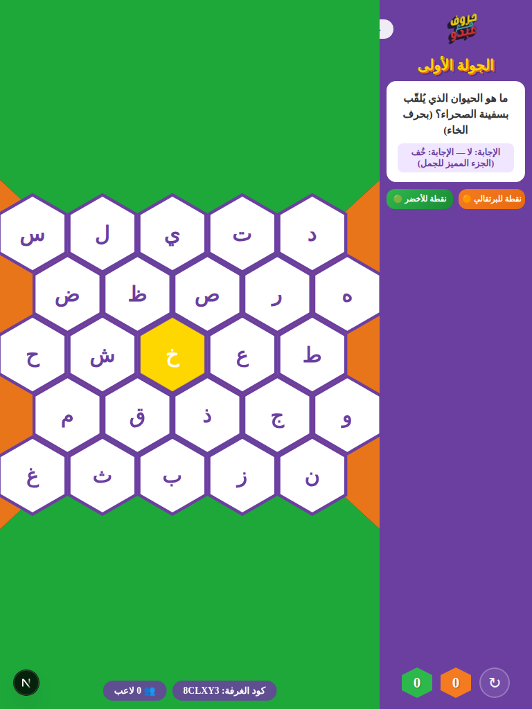
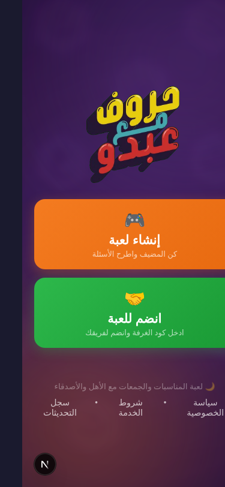

<div align="center">
  
  
  # حروف مع عبدو (Letters with Abdo)
  
  **لعبة الحروف العربية التفاعلية - تحدي الفرق في الوقت الحقيقي**  
  *(Interactive Arabic Letters Game - Real-time Team Challenge)*

[](https://opensource.org/licenses/MIT)
[](https://nextjs.org/)
[](https://peerjs.com/)
[](https://huroof-abdo.vercel.app/)

[🎮 العب الآن (Play Now)](https://huroof-abdo.vercel.app/) • [📲 التثبيت والتحميل (Install)](https://huroof-abdo.vercel.app/install) • [🤝 المساهمة (Contributing)](#-المساهمة-contributing) • [📋 سجل التغييرات (Changelog)](#-الروابط-المهمة-important-links)

</div>

---

## 🌟 اللمحة العامة (Overview)

**حروف مع عبدو** هو تطبيق ويب تفاعلي مصمم للتسلية مع العائلة والأصدقاء، يعتمد على تحديات الحروف العربية. اللعبة تجمع فريقين (البرتقالي والأخضر) في منافسة ممتعة للسيطرة على لوحة شكل سداسي (Hex Board) عبر الإجابة الصحيحة على الأسئلة واختيار الحروف المناسبة.

يقدم التطبيق واجهة مستخدم احترافية وسلسة بتصميم داكن وزجاجي يضفي طابعاً فريداً ومميزاً على تجربة المستخدم. **مُنشور ومتاح مجاناً على:** [https://huroof-abdo.vercel.app/](https://huroof-abdo.vercel.app/)

## 📸 لقطات الشاشة (Screenshots)

<div align="center">

### الصفحة الرئيسية (Landing Page)



### لوحة اللعبة - عرض سطح المكتب (Game Board - Desktop)



### لوحة اللعبة - لوحي (Game Board - Tablet)



### عرض الجوال (Mobile View)



</div>

## ✨ الميزات (Features)

- 🎮 **لعب جماعي في الوقت الفعلي:** تنافس بين لاعبين باستخدام تقنية (Peer-to-Peer عبر PeerJS) بدون تأخير.
- 🔔 **نظام الجرس التفاعلي (Buzzer):** أول من يضغط يربح حق الإجابة، مع واجهة تنبيهات فورية للمضيف.
- 👁️ **وضع المشاهد (Spectate Mode):** إمكانية الانضمام للغرفة كمراقب لمتابعة اللعبة والأسئلة مباشرة دون مشاركة أو رؤية الإجابات.
- 📱 **تجربة غامرة (PWA & Fullscreen):** إمكانية تثبيت اللعبة على الشاشة الرئيسية (Add to Home Screen) للعب في وضع الشاشة الكاملة كلياً.
- 📲 **ماسح QR مدمج بالكاميرا:** انضمام فوري عبر مسح كود المضيف مباشرة من واجهة اللعبة الجوالة.
- 🎨 **تصميم عصري وجذاب:** واجهات مستخدم متقدمة بنمط (Glassmorphism) وتأثيرات حركية فاخرة.
- 🧩 **لوحة سداسية تفاعلية:** لوحة لعب سداسية مبتكرة تعتمد على الأحرف العربية مع تحديثات فورية للحالة.
- ⚙️ **تقنيات حديثة:** مبني باستخدام أحدث إصدارات Next.js 16 و React 19 لسرعة أداء فائقة.
- 🔄 **إعادة اتصال تلقائي:** نظام صلب لاستعادة الاتصال عند انقطاع الشبكة أو إغلاق الشاشة المؤقت.
- 🌐 **نشر مجاني:** متاح للعب مباشرةً على [https://huroof-abdo.vercel.app/](https://huroof-abdo.vercel.app/)

## 🚀 تقنيات المشروع (Tech Stack)

- **الإطار الرئيسي:** [Next.js 16](https://nextjs.org/) (App Router)
- **المكتبة الأساسية:** [React 19](https://react.dev/)
- **الشبكة (Network):** [PeerJS](https://peerjs.com/) للاتصال المباشر بين اللاعبين.
- **التصميم (Styling):** CSS Modules / Plain CSS (Custom glassmorphism design system).
- **الخطوط (Fonts):** خط `Cairo` لدعم ممتاز وتحسينات رائعة للنصوص العربية.
- **النشر (Deployment):** [Vercel](https://vercel.com/) على الرابط [https://huroof-abdo.vercel.app/](https://huroof-abdo.vercel.app/)

## � التثبيت والتحميل (Installation & Download)

### 🌐 الويب (Web - Easiest)

جميع الأجهزة والمتصفحات:

```
https://huroof-abdo.vercel.app/
```

- لا يتطلب تحميل أي شيء
- يعمل على iPhone, iPad, Android, الكمبيوتر, والويب
- يتحدث تلقائياً مع التحديثات الجديدة

### 📱 تطبيق Android (App - Better Performance)

**متطلبات:** Android 6.0 أو أحدث

1. **تحميل APK:**

   ```
   https://github.com/KNIGHTABDO/huroof-ABDO/releases/download/v2.1.1/app-release.apk
   ```

2. **التثبيت:**
   - انقر على ملف APK المحمّل
   - اضغط "تثبيت"
   - انتظر اكتمال التثبيت

3. **الاستخدام:**
   - افتح التطبيق من قائمة التطبيقات
   - استمتع بأداء محسّنة! 🎮

**الفوائد:**

- ⚡ أداء أسرع من الويب
- 💾 استهلاك أقل للبيانات
- 📵 يعمل بشكل أفضل مع الاتصالات البطيئة
- 🔔 جاهز للميزات التطبيقية المستقبلية

### 🍎 iPhone / iPad

**الطريقة 1: الدخول المباشر (الأسهل)**

- افتح Safari
- انتقل إلى https://huroof-abdo.vercel.app/
- ابدأ اللعب فوراً! 🎮

**الطريقة 2: إضافة اختصار (اختياري)**

- في Safari, انقر على "مشاركة" (Share)
- اختر "إضافة إلى الشاشة الرئيسية"
- الآن ستظهر اللعبة كتطبيق في الشاشة الرئيسية
- نفس الأداء, بدون تنزيل من App Store!

---

## 🛠 التطوير المحلي (Local Development)

### المتطلبات

- Node.js 18+ و npm
- للـ Android: Java 17, Android SDK

### الخطوات

1. **استنساخ المستودع (Clone the repository)**

   ```bash
   git clone https://github.com/KNIGHTABDO/huroof-ABDO.git
   cd huroof-ABDO
   ```

2. **تثبيت الحزم (Install dependencies)**

   ```bash
   npm install
   ```

3. **تشغيل خادم التطوير (Run development server)**

   ```bash
   npm run dev
   ```

   افتح [http://localhost:3000](http://localhost:3000) في متصفحك.

## 🧪 فحوصات الجودة (Quality Checks)

قبل رفع أي تغييرات، شغّل الأوامر التالية:

```bash
npm run lint
npm test
npm run test:coverage
```

- `npm run lint`: فحص جودة الكود وقواعد ESLint.
- `npm test`: تشغيل اختبارات الوحدة (Jest).
- `npm run test:coverage`: توليد تقرير تغطية الاختبارات لتسهيل الصيانة المستقبلية.

## 🏗 بنية التشغيل (Runtime Infrastructure)

للتفاصيل الفنية حول الواجهات، طبقات الاتصال، وإعدادات التطوير، راجع:

- [INFRASTRUCTURE.md](INFRASTRUCTURE.md)
- [Android Build Guide](android/README.md)

## 🤖 Android APK / AAB

يمكنك إصدار نسخة Android من نفس هذا المشروع (بدون كتابة تطبيق ثاني) عبر TWA:

> ملاحظة: ملفات مشروع Android (Gradle/TWA) معزولة داخل `android/twa` لتجنب أي تعارض مسارات مع Next.js.

```bash
npm run android:twa:init
npm run android:twa:build
```

ولإنشاء ملف الربط الرسمي بين Android والتطبيق:

```bash
npm run android:assetlinks:dry
npm run android:assetlinks
```

> دليل الخطوات الكامل موجود هنا: [android/README.md](android/README.md)

## ⚙️ GitHub Auto Build (APK/AAB)

تمت إضافة workflow تلقائي في:

- `.github/workflows/android-release.yml`

السلوك الحالي:

- أي `push` على `main`:
  - إذا كانت secrets موجودة: يبني Release APK + AAB.
  - إذا secrets غير موجودة: يبني Debug APK فقط (حتى لا يفشل الـ CI).
- أي Tag يبدأ بـ `v` (مثل `v2.1.0`): يتطلب secrets، ثم يبني Release APK + AAB وينشرهم تلقائياً في GitHub Releases.

الأسرار المطلوبة في GitHub (Repository Settings → Secrets and variables → Actions):

- `ANDROID_KEYSTORE_BASE64`
- `ANDROID_KEYSTORE_PASSWORD`
- `ANDROID_KEY_ALIAS`
- `ANDROID_KEY_PASSWORD`

مثال تشغيل Release تلقائي:

```bash
git tag v2.1.0
git push origin v2.1.0
```

## 📲 صفحة التثبيت للمستخدمين

لجعل تجربة التحميل أو اللعب مباشرة واضحة للمستخدم النهائي، تم إضافة صفحة مخصصة داخل التطبيق:

- [https://huroof-abdo.vercel.app/install](https://huroof-abdo.vercel.app/install)

وتتضمن:

- اللعب المباشر عبر الويب
- رابط الإصدارات الرسمية على GitHub
- توضيح الفرق بين APK و AAB للمستخدم

رابط الإصدارات الرسمية:

- [https://github.com/KNIGHTABDO/huroof-ABDO/releases](https://github.com/KNIGHTABDO/huroof-ABDO/releases)

## 🤝 المساهمة (Contributing)

نرحب دائماً بالمساهمين! لتطوير أو إصلاح أو تحسين اللعبة، يرجى مراجعة [دليل المساهمة (CONTRIBUTING.md)](CONTRIBUTING.md) للتعرف على الخطوات والقواعد.

## 📜 الروابط المهمة (Important Links)

- 🎮 [العب الآن (Play Now)](https://huroof-abdo.vercel.app/)
- 📲 [التثبيت والتحميل (Install)](https://huroof-abdo.vercel.app/install)
- 📦 [إصدارات GitHub (Releases)](https://github.com/KNIGHTABDO/huroof-ABDO/releases)
- 🔒 [سياسة الخصوصية (Privacy Policy)](https://huroof-abdo.vercel.app/privacy)
- 📋 [شروط الخدمة (Terms of Service)](https://huroof-abdo.vercel.app/terms)
- 🔄 [سجل التغييرات (Changelog)](https://huroof-abdo.vercel.app/changelog)

## 📄 الترخيص (License)

هذا المشروع مرخص بموجب أداة **MIT License** - يرجى الاطلاع على ملف [LICENSE](LICENSE) لمزيد من التفاصيل.
